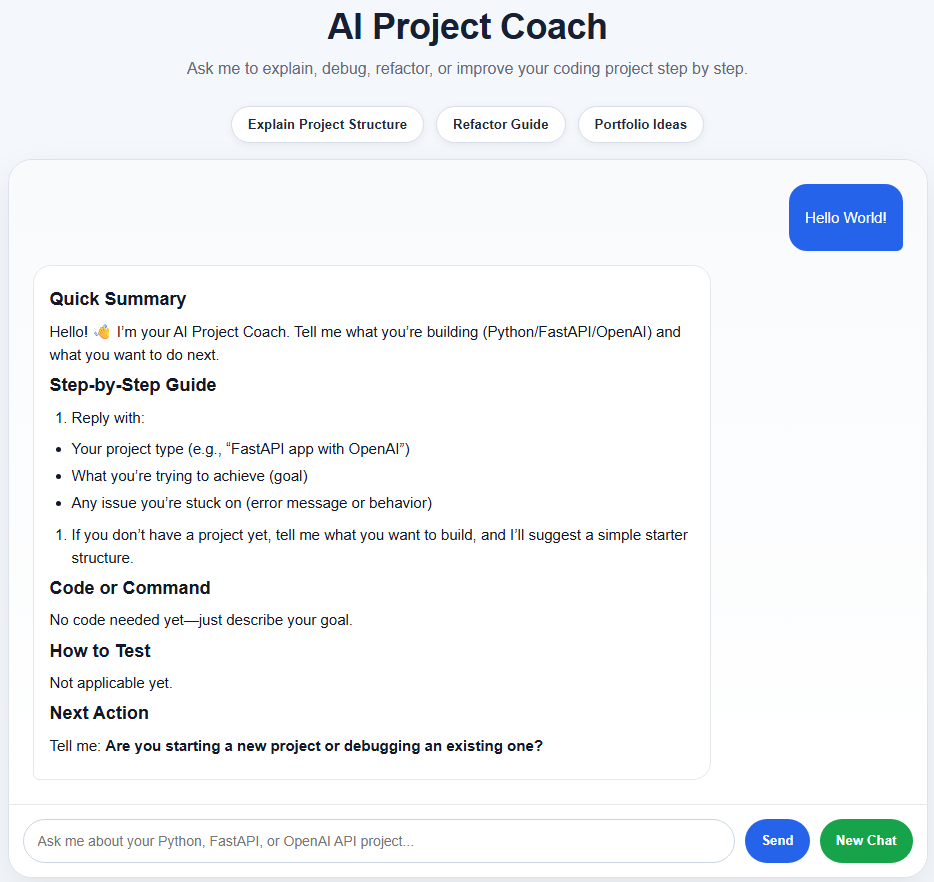

# AI Project Coach Chatbot

AI Project Coach Chatbot is a FastAPI web chatbot that helps beginner developers understand, debug, refactor, and improve coding projects step by step.

The project was built to demonstrate backend application structure, OpenAI API integration, session-based chat handling, frontend rendering, environment configuration, Docker-based local deployment, and basic automated testing.

## Screenshot



## Features

- FastAPI backend with a clean router, service, model, schema, and dependency structure
- OpenAI Responses API integration for AI-generated coaching replies
- Custom system prompt that guides the assistant to act as an AI Project Coach
- Session-based chat handling using signed browser sessions
- In-memory chat storage for learning and demonstration purposes
- Simple web interface built with HTML, CSS, and JavaScript
- Markdown-like response formatting for headings, bullet points, numbered lists, inline code, and code blocks
- Environment variable management using `.env`
- Safe public configuration using `.env.example`
- Docker and Docker Compose support for containerized local deployment
- Basic pytest configuration for backend tests

## Demo Use Cases

The chatbot can help users:

- Understand a Python or FastAPI project structure
- Debug common Python, FastAPI, OpenAI API, Conda, VS Code, and dotenv issues
- Refactor code step by step
- Improve a coding project for GitHub portfolio presentation
- Generate beginner-friendly explanations of backend code
- Suggest next features for an AI engineering project

## Tech Stack

- Python
- FastAPI
- OpenAI API
- Jinja2
- HTML
- CSS
- JavaScript
- python-dotenv
- itsdangerous
- pytest
- Conda
- Docker
- Docker Compose

## Project Structure

```text
ai-project-coach-chatbot
├── README.md
├── Dockerfile
├── docker-compose.yml
├── .dockerignore
├── requirements.txt
├── environment.yml
├── pytest.ini
├── .env.example
├── .gitignore
├── assets/
│   └── screenshot.png
├── tests/
│   └── test_chat_manager.py
└── src/
    └── ai_project_coach_chatbot/
        ├── __init__.py
        ├── main.py
        ├── core/
        │   ├── __init__.py
        │   ├── config.py
        │   └── dependencies.py
        ├── routers/
        │   ├── __init__.py
        │   └── chat_router.py
        ├── models/
        │   ├── __init__.py
        │   └── chat.py
        ├── schemas/
        │   ├── __init__.py
        │   └── chat_schema.py
        ├── services/
        │   ├── __init__.py
        │   └── chat_service.py
        ├── prompts/
        │   └── system_prompt.txt
        ├── static/
        │   └── style.css
        └── templates/
            └── chat.html
```

## How It Works

The application follows a simple layered architecture.

1. `main.py` creates and configures the FastAPI application.
2. `chat_router.py` defines the web routes and API endpoints.
3. `chat_service.py` handles the main business logic and OpenAI API call.
4. `chat.py` stores chat messages in memory.
5. `chat_schema.py` defines request and response models using Pydantic.
6. `system_prompt.txt` defines how the assistant should behave.
7. `chat.html` and `style.css` provide the browser-based chat interface.
8. `Dockerfile` and `docker-compose.yml` allow the app to run inside a Docker container.

## Setup Instructions

### 1. Clone the repository

```bash
git clone https://github.com/gyres/ai-project-coach-chatbot.git
cd ai-project-coach-chatbot
```

### 2. Create the Conda environment

The recommended local setup method is to use the provided `environment.yml` file:

```bash
conda env create -f environment.yml
conda activate ai-project-coach-chatbot
```

If the environment already exists and you want to update it:

```bash
conda env update -f environment.yml --prune
conda activate ai-project-coach-chatbot
```

### 3. Alternative setup using pip

If you prefer to use an existing Python environment, install dependencies with:

```bash
pip install -r requirements.txt
```

### 4. Create your `.env` file

Create a `.env` file in the project root.

Git Bash:

```bash
cp .env.example .env
```

PowerShell:

```powershell
Copy-Item .env.example .env
```

Then update the `.env` file with your own values:

```env
OPENAI_API_KEY=your_openai_api_key_here
OPENAI_MODEL=your_chat_model_name_here
SESSION_SECRET_KEY=replace_with_a_random_secret_key
APP_HOST=0.0.0.0
APP_PORT=3000
```

Do not commit your real `.env` file to GitHub.

## Running the App Locally

Run the FastAPI app with Uvicorn.

Git Bash:

```bash
PYTHONPATH=src python -m uvicorn ai_project_coach_chatbot.main:app --reload --port 3000
```

PowerShell:

```powershell
$env:PYTHONPATH = "src"
python -m uvicorn ai_project_coach_chatbot.main:app --reload --port 3000
```

Then open your browser and go to:

```text
http://127.0.0.1:3000
```

You can also run the app through Python.

Git Bash:

```bash
PYTHONPATH=src python -m ai_project_coach_chatbot.main
```

PowerShell:

```powershell
$env:PYTHONPATH = "src"
python -m ai_project_coach_chatbot.main
```

When running through `python -m ai_project_coach_chatbot.main`, the app will use `APP_HOST` and `APP_PORT` from your `.env` file or the default values in `config.py`.

## Running with Docker

This project can also be run with Docker.

Docker is useful because it runs the app in a containerized environment without requiring users to manually create a Conda environment.

### 1. Make sure Docker Desktop is running

Before running the Docker commands, start Docker Desktop on your computer.

### 2. Build the Docker image

```bash
docker build -t ai-project-coach-chatbot .
```

### 3. Run the Docker container

```bash
docker run --env-file .env -p 3000:3000 ai-project-coach-chatbot
```

Then open your browser and go to:

```text
http://127.0.0.1:3000
```

### 4. Stop the Docker container

Press:

```text
Ctrl + C
```

## Running with Docker Compose

Docker Compose is the simpler recommended Docker method for this project.

Run:

```bash
docker compose up --build
```

Then open your browser and go to:

```text
http://127.0.0.1:3000
```

To stop and remove the container:

```bash
docker compose down
```

## Running Tests

Run:

```bash
python -m pytest
```

The `pytest.ini` file adds the `src` folder to the Python path and tells pytest to look inside the `tests` folder.

## Environment Variables

| Variable | Required | Description |
|---|---:|---|
| `OPENAI_API_KEY` | Yes | Your OpenAI API key |
| `OPENAI_MODEL` | Yes | The OpenAI model used by the chatbot |
| `SESSION_SECRET_KEY` | Yes | Secret key used for signed browser sessions |
| `APP_HOST` | No | Host used when running the app through `python -m ai_project_coach_chatbot.main` |
| `APP_PORT` | No | Port used when running the app through `python -m ai_project_coach_chatbot.main` |

## Example Prompts

Try asking the chatbot:

```text
Explain my FastAPI project structure like I am a beginner.
```

```text
Suggest how I can refactor this project step by step.
```

```text
Help me turn this project into a stronger AI engineering portfolio project.
```

```text
Why do we separate routers, services, models, and schemas?
```

## Current Limitations

- This is a learning and portfolio project, not a production system.
- Chat history is stored in memory and resets when the server restarts.
- There is no user login or account system.
- There is no database yet.
- The frontend uses plain JavaScript instead of a modern frontend framework.
- The app does not currently support file uploads.
- The app does not currently stream responses token by token.
- The Docker setup is intended for local development and portfolio demonstration, not production deployment.

## License

This project is licensed under the MIT License.

## Contact

- Name: Ou Yang Yu
- GitHub: https://github.com/gyres